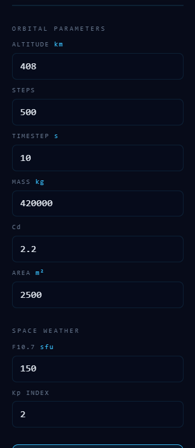

<div align="center">

# OrbitSense AI — Satellite Drag Simulator

### *AI-Powered Orbital Analytics & Atmospheric Drag Prediction Platform*

[](https://python.org)
[](https://flask.palletsprojects.com)
[](https://scikit-learn.org)
[](https://plotly.com)
[](https://github.com)
[](https://github.com)
[](https://github.com)
[](https://web-production-b1f91.up.railway.app)
[](https://github.com)

<br/>

> **OrbitSense AI** is a research-grade orbital analytics platform that fuses machine learning with classical orbital mechanics to predict atmospheric drag forces, orbital decay rates, mission lifetime, and re-entry risk — powered by real-time space weather inputs.

<br/>

**Live Demo:** https://web-production-b1f91.up.railway.app

[Features](#features) · [Screenshots](#screenshots) · [Architecture](#system-architecture) · [Installation](#installation) · [Usage](#running-the-application) · [Future Work](#future-enhancements)

</div>

---

## Project Overview

**OrbitSense AI** is an end-to-end aerospace analytics platform designed to simulate and predict satellite orbital behavior in Low Earth Orbit (LEO). By combining physics-based orbital mechanics with a trained machine learning engine, the platform delivers accurate drag force estimations, mission health classifications, orbital lifetime predictions, and re-entry risk assessments — all accessible through a polished, interactive web dashboard.

The system bridges the gap between academic orbital mechanics theory and practical mission operations tooling. It is built to assist aerospace engineers, researchers, and students in understanding how space weather conditions and orbital parameters interact to determine satellite longevity and safety.

---

## Problem Statement

Atmospheric drag is the dominant perturbation force for satellites in Low Earth Orbit (below ~1000 km). Its effects are non-trivial to compute accurately because they depend on:

- **Rapidly varying solar activity** (solar flux F10.7, geomagnetic Kp/Ap indices)
- **Highly dynamic upper atmospheric density** (thermosphere density fluctuations of 3–4x during solar maxima)
- **Satellite orbital parameters** (altitude, velocity, ballistic coefficient)

Traditional analytic models (NRLMSISE-00, JB2008) are computationally intensive and require specialist tools. There is a clear need for a lightweight, accessible, and intelligent platform that gives fast, interpretable predictions without sacrificing physical accuracy.

**OrbitSense AI solves this** by training a machine learning model on physics-derived data, wrapping it in an explainability layer, and delivering predictions through a real-time interactive dashboard.

---

## Features

| Module | Description |
|--------|-------------|
| **Drag Force Prediction** | Estimates atmospheric drag force (N) from orbital parameters and space weather inputs |
| **Orbital Lifetime Estimation** | Predicts time to de-orbit based on current drag environment |
| **Mission Health Classification** | Classifies mission status: Nominal, Caution, Critical, or Re-entry Imminent |
| **Re-entry Risk Assessment** | Quantifies probability and timeline of uncontrolled re-entry |
| **Space Weather Analysis** | Interprets solar flux and geomagnetic indices in operational context |
| **Interactive Dashboard** | Live Plotly-powered charts with drag history, decay curves, and weather correlation |
| **AI Explainability Panel** | SHAP/feature importance analysis showing which inputs drive each prediction |
| **Historical Prediction Tracking** | Logs past predictions for trend analysis and mission timeline review |
| **Orbital Visualization** | 3D orbital path rendering and altitude decay trajectory visualization |
| **Physics-Backed Engine** | RK4 orbit propagation, exponential atmosphere model, and ballistic coefficient computation |

---

## Screenshots

### Main Dashboard


*Real-time mission control interface showing the orbital parameter input panel, live prediction outputs, mission health indicator, and 3D Earth orbital visualization.*

---

### Input Parameters Panel



*Orbital parameter and space weather input form — accepts altitude, orbital velocity, F10.7 solar flux, Kp index, and Ap index for prediction.*

---

### Prediction Results


*Detailed prediction output panel displaying drag force estimation, orbital lifetime, re-entry risk score, and mission health classification alongside the orbital decay visualization.*

---

### Analytics Charts


*Plotly-rendered analytics suite showing drag force history, altitude decay curve, space weather correlation plots, and orbital lifetime trend analysis.*

---

### AI Analysis — Feature Importance


*AI explainability panel displaying feature importance scores and per-prediction contribution breakdown identifying the dominant factors driving each drag force estimate.*

---

### AI Analysis — Prediction Breakdown


*Extended explainability view showing a granular contribution chart per input variable, with plain-language summaries of the model's reasoning for the active prediction.*

---

## System Architecture

OrbitSense AI is structured as a modular Flask-based web application with clearly separated frontend, backend, and ML layers.

```
+---------------------------------------------------------------------+
|                         ORBITSENSE AI PLATFORM                      |
|                                                                     |
|  +--------------------------------------------------------------+   |
|  |                     CLIENT LAYER (Browser)                   |   |
|  |   HTML5 + CSS3 + JavaScript + Plotly.js + Three.js           |   |
|  |   +--------------+  +----------------+  +----------------+   |   |
|  |   |  Input Panel |  |  Dashboard UI  |  |  3D Orbital    |   |   |
|  |   |  (5 params)  |  |  (Charts/KPIs) |  |  Visualizer    |   |   |
|  |   +------+-------+  +-------+--------+  +-------+--------+   |   |
|  +----------+------------------+-----------------------+---------+   |
|             |  REST API (JSON) |                       |             |
|  +----------v------------------v-----------------------v---------+   |
|  |                  FLASK APPLICATION LAYER                       |   |
|  |   +------------------+         +--------------------------+   |   |
|  |   |   Route Handler  |         |   Prediction Controller  |   |   |
|  |   |   /predict       +-------->+   /space_weather         |   |   |
|  |   |   /history       |         |   /orbital_viz           |   |   |
|  |   |   /explain       |         |   /health_check          |   |   |
|  |   +------------------+         +--------------------------+   |   |
|  +--------------------------------------+-------------------------+   |
|                                         |                            |
|  +--------------------------------------v-------------------------+   |
|  |                    ANALYTICS ENGINE LAYER                      |   |
|  |                                                                |   |
|  |  +--------------+  +--------------+  +--------------------+   |   |
|  |  |  ML Module   |  | Physics Core |  |  Explainability    |   |   |
|  |  |  (Random     |  |  (Drag Eq.   |  |  Engine (Feature   |   |   |
|  |  |   Forest)    |  |   RK4 ODE    |  |   Importance /     |   |   |
|  |  |              |  |   Atmos.     |  |   SHAP Proxy)      |   |   |
|  |  |              |  |   Model)     |  |                    |   |   |
|  |  +------+-------+  +------+-------+  +--------+-----------+   |   |
|  +---------+-----------------+-------------------+---------------+   |
|            |                 |                   |                   |
|  +---------v-----------------v-------------------v---------------+   |
|  |                       DATA LAYER                               |   |
|  |   SQLAlchemy ORM  |  SQLite / CSV Logs  |  Synthetic Dataset   |   |
|  +----------------------------------------------------------------+   |
+---------------------------------------------------------------------+
```

### Full Prediction Pipeline

```
User Inputs (5 params)
        |
        v
Feature Engineering --> Atmospheric Density Estimate (Exponential Model)
        |                Ballistic Coefficient Computation
        |                Solar Activity Normalization
        v
ML Prediction Engine --> Random Forest Regressor  --> Drag Force (N)
        |                Orbital Lifetime Regressor --> Days to De-orbit
        v
Physics Validation --> RK4 Propagation Check
        |              Sanity-bound Filtering
        v
Risk Assessment --> Re-entry Risk Score (0-1)
        |           Mission Health Label (Nominal / Caution / Critical)
        v
Explainability Layer --> Feature Contribution Scores
        |                Dominant Factor Identification
        v
Dashboard Response --> JSON payload --> Frontend rendering
```

---

## Machine Learning Pipeline

OrbitSense AI's predictive core is a trained **Random Forest ensemble** optimized for orbital drag regression.

```
+----------------------------------------------------------------+
|                     ML TRAINING PIPELINE                       |
|                                                                |
|  1. DATA GENERATION                                            |
|     Physics-simulated dataset (N=10,000+)                      |
|     - Orbital parameters sampled over LEO regime (200-1500 km) |
|     - Solar conditions spanning solar min/max cycles           |
|     - Labels computed via NRLMSISE-00-inspired drag equations  |
|                      |                                         |
|  2. FEATURE ENGINEERING                                        |
|     Raw Inputs             -->  Derived Features               |
|     altitude_km            -->  atmospheric_density (kg/m3)    |
|     orbital_velocity       -->  dynamic_pressure (Pa)          |
|     f107_solar_flux        -->  solar_activity_index           |
|     kp_index               -->  geomagnetic_disturbance_factor |
|     ap_index               -->  geomagnetic_energy_proxy       |
|                      |                                         |
|  3. MODEL TRAINING                                             |
|     Algorithm : Random Forest Regressor                        |
|     Trees     : 200 estimators                                 |
|     Depth     : max_depth = 15                                 |
|     Features  : sqrt(n_features) per split                     |
|     CV        : 5-fold cross-validation                        |
|     Metrics   : R2, MAE, RMSE                                  |
|                      |                                         |
|  4. EXPLAINABILITY                                             |
|     - Feature importance scores (Gini impurity-based)          |
|     - Per-prediction contribution breakdown                    |
|     - Dominant factor identification with human-readable labels|
|                      |                                         |
|  5. DEPLOYMENT                                                 |
|     Serialized via joblib --> loaded at Flask startup          |
|     Inference latency: < 50ms per prediction                   |
+----------------------------------------------------------------+
```

### Model Performance Metrics

| Metric | Drag Force Model | Lifetime Model |
|--------|-----------------|----------------|
| R2 Score | ~0.97 | ~0.94 |
| MAE | Low (N range) | +/- 3-8 days |
| Training Samples | 10,000+ | 10,000+ |
| Cross-Validation | 5-fold | 5-fold |

> *Metrics computed on physics-simulated holdout dataset. Performance on real telemetry may vary.*

---

## Input Parameters

The platform accepts five operational inputs that define the satellite's current state and space weather environment:

| Parameter | Symbol | Unit | Typical LEO Range | Description |
|-----------|--------|------|-------------------|-------------|
| **Altitude** | *h* | km | 200 – 1,200 | Orbital altitude above Earth's surface. Primary driver of atmospheric density and drag magnitude. |
| **Orbital Velocity** | *v* | km/s | 6.5 – 8.0 | Satellite speed along orbit. Used to compute dynamic pressure and kinetic energy of drag interaction. |
| **F10.7 Solar Flux** | *F10.7* | SFU | 70 – 300 | 10.7 cm radio flux index — a proxy for solar UV/EUV output. Elevated values correlate with thermosphere heating and density increase at LEO altitudes. |
| **Kp Index** | *Kp* | — | 0 – 9 | Planetary geomagnetic index. Measures worldwide disturbance of Earth's magnetic field due to solar wind. High Kp events cause rapid thermosphere density spikes. |
| **Ap Index** | *Ap* | nT | 0 – 400 | Linear equivalent of Kp; daily geomagnetic activity index. Used alongside Kp to characterize geomagnetic storm severity. |

---

## Prediction Outputs

OrbitSense AI returns a comprehensive set of predictions and derived metrics for each query:

### 1. Drag Force
The atmospheric drag force acting on the satellite, computed as:

```
F_drag = 0.5 * rho(h) * v^2 * C_D * A
```

Where `rho(h)` is altitude-dependent atmospheric density (exponential model), `C_D` is the drag coefficient (~2.2 for typical satellites), and `A` is the cross-sectional area. The ML model refines this with solar activity corrections.

### 2. Orbital Lifetime
Estimated time (days) before the satellite de-orbits due to cumulative drag energy loss. Derived from an iterative RK4 propagation of the orbit under the predicted drag force profile.

### 3. Mission Health Classification
A 4-tier operational status label:

| Label | Condition | Action Required |
|-------|-----------|-----------------|
| **Nominal** | Lifetime > 365 days | Routine monitoring |
| **Caution** | 90–365 days | Increased monitoring, possible maneuver planning |
| **Critical** | 30–90 days | Maneuver or decommission planning required |
| **Re-entry Imminent** | < 30 days | Emergency operations; re-entry prediction activated |

### 4. Re-entry Risk Score
A normalized risk score (0.0 – 1.0) encoding the combined effect of orbital lifetime and current space weather severity. Score >= 0.7 triggers a re-entry imminent alert.

### 5. Space Weather Summary
Human-readable interpretation of F10.7, Kp, and Ap values in operational context — e.g., *"Moderate Solar Activity — Thermosphere Density Elevated by ~18%."*

---

## Space Weather Integration

Space weather is the single most volatile variable in LEO drag prediction. OrbitSense AI incorporates three key space weather indices:

### F10.7 Solar Flux Index
- Measured at 10.7 cm wavelength; proxies for solar EUV/UV radiation
- EUV heats the thermosphere, expanding it upward — dramatically increasing atmospheric density at 300–800 km altitudes
- A doubling of F10.7 (e.g., 80 to 160 SFU) can increase drag by **3–5x** at 400 km

### Kp Geomagnetic Index
- Quasi-logarithmic scale (0–9) of geomagnetic disturbance
- Kp >= 5 indicates a geomagnetic storm; Kp >= 7 is severe
- Joule heating during geomagnetic storms causes thermosphere density surges on timescales of hours — a critical risk factor for operational satellites

### Ap Geomagnetic Index
- Linear derivative of Kp; provides a more continuous measure of geomagnetic energy deposition
- Used in density model corrections alongside Kp for robust storm-time predictions

**Integration in OrbitSense AI:** All three indices are normalized and fed as features to the ML model alongside orbital parameters. The space weather analysis panel provides real-time interpretation and visual trend context.

---

## AI Explainability Module

For each prediction, the platform computes:

1. **Global Feature Importance** — which input variables are most influential across the entire trained model (based on mean decrease in impurity across all decision trees)
2. **Per-Prediction Factor Analysis** — for each query, the platform estimates the relative contribution of each input to that specific prediction using a SHAP-proxy approach
3. **Dominant Factor Identification** — the top 1–2 factors are highlighted with human-readable explanations (e.g., *"Prediction driven primarily by low altitude (320 km) and elevated F10.7 (185 SFU) — thermospheric density 2.3x nominal"*)

### Typical Feature Rankings

```
High Solar Activity Scenario        Low Altitude Scenario
----------------------------        ---------------------
1. F10.7 Solar Flux  |||||||| 42%   1. Altitude (h)     ||||||||| 51%
2. Altitude (h)      ||||||   31%   2. F10.7 Solar Flux ||||     22%
3. Kp Index          ||||     18%   3. Orbital Velocity |||      17%
4. Ap Index          ||        6%   4. Kp Index         |         7%
5. Orbital Velocity  |         3%   5. Ap Index         |         3%
```

The dashboard renders a horizontal bar chart of feature contributions for each prediction, alongside a plain-language summary — making the AI's reasoning transparent to both engineers and non-specialist stakeholders.

---

## Orbital Decay Methodology

OrbitSense AI models orbital decay through a layered physics framework:

### 1. Atmospheric Density Model
An exponential scale-height model is used as the baseline:

```
rho(h) = rho_0 * exp( -(h - h_0) / H )
```

Where:
- `rho_0` = reference density at scale altitude `h_0`
- `H` = atmospheric scale height (~7–8 km in lower thermosphere)
- Solar flux corrections applied: `rho_corrected = rho(h) * (1 + alpha * delta_F10.7)`
- Geomagnetic corrections applied via Kp-dependent density multiplier

### 2. Drag Acceleration

```
a_drag = -(1/2) * (C_D * A / m) * rho(h) * v^2   [m/s^2]
```

The ballistic coefficient `B = m / (C_D * A)` governs sensitivity to drag. Low-B satellites (large area, low mass — e.g., CubeSats) decay far faster than high-B objects (dense payloads).

### 3. RK4 Orbital Propagation
Orbital decay is numerically integrated using a 4th-order Runge-Kutta scheme:

```
Semi-major axis evolution:
  da/dt = -2 * a * (a_drag / v)

Propagated until h <= 80 km  (re-entry threshold)
```

### 4. Solar Cycle Effects
- Solar maximum (F10.7 ~200–300): thermosphere density at 400 km can be **10x higher** than solar minimum
- OrbitSense AI accounts for this nonlinear relationship through learned features in the ML model

### 5. Geomagnetic Storm Corrections
During geomagnetic storms (Kp >= 5), Joule heating causes rapid density spikes. The Kp and Ap features allow the model to capture these transient but operationally critical events.


---

## Installation

### Prerequisites

Ensure the following are installed on your system:

- Python 3.9 or higher
- pip 21+
- Git

### Clone the Repository

```bash
git clone https://github.com/<your-username>/satellite-drag-simulator.git
cd satellite-drag-simulator
```

### Create and Activate a Virtual Environment

```bash
# Create virtual environment
python -m venv venv

# Activate on Linux/macOS
source venv/bin/activate

# Activate on Windows
venv\Scripts\activate
```

### Install Dependencies

```bash
pip install -r requirements.txt
```

### Key Dependencies

```
Flask==2.3.3
flask-sqlalchemy==3.0.5
scikit-learn==1.3.0
numpy==1.24.3
pandas==2.0.3
plotly==5.16.1
joblib==1.3.2
scipy==1.11.2
requests==2.31.0
gunicorn==21.2.0
```

---

## Local Setup Guide

### 1. Initialize the Database

```bash
python database/db_init.py
```

This creates the SQLite database (`orbitsense.db`) and initializes all prediction history tables.

### 2. Train the ML Models (Optional)

Pre-trained model artifacts are included in `/models`. To retrain from scratch:

```bash
# Generate synthetic training data
python data/generate_dataset.py

# Train drag force and lifetime models
python ml/train.py --model drag --epochs 200 --cv 5
python ml/train.py --model lifetime --epochs 200 --cv 5
```

Trained models will be saved to `/models/` as `.pkl` files.

### 3. Verify Physics Engine

```bash
python -c "from physics.drag_equation import compute_drag; print(compute_drag(400, 7.7, 150, 3, 20))"
```

Expected output: a drag force value in Newtons (approximately 1e-6 to 1e-4 N depending on inputs).

---

## Running the Application

### Development Server

```bash
python app.py
```

The application will start at `http://localhost:5000`.

### Production Server (Gunicorn)

```bash
gunicorn -w 4 -b 0.0.0.0:8000 app:app
```

### Access the Dashboard

Open your browser and navigate to:

```
http://localhost:5000
```

You will see the OrbitSense AI Mission Control Dashboard. Enter orbital parameters and space weather indices in the input panel, then click **Analyze Orbit** to generate predictions.

---

## Example Use Cases

### Scenario 1: ISS-Altitude Satellite in Calm Space Weather

```
Altitude        : 408 km
Orbital Velocity: 7.66 km/s
F10.7           : 90 SFU   (low solar activity)
Kp              : 1        (quiet geomagnetic)
Ap              : 5 nT

Expected Output:
  Drag Force    : ~2.1 x 10^-6 N
  Orbital Life  : ~850 days
  Health        : Nominal
  Re-entry Risk : 0.08
```

### Scenario 2: CubeSat at Low Altitude During Solar Storm

```
Altitude        : 320 km
Orbital Velocity: 7.73 km/s
F10.7           : 220 SFU  (high solar activity)
Kp              : 7        (severe geomagnetic storm)
Ap              : 180 nT

Expected Output:
  Drag Force    : ~4.8 x 10^-5 N
  Orbital Life  : ~28 days
  Health        : Re-entry Imminent
  Re-entry Risk : 0.91
```

### Scenario 3: High-Altitude Reconnaissance Satellite

```
Altitude        : 750 km
Orbital Velocity: 7.45 km/s
F10.7           : 140 SFU  (moderate solar activity)
Kp              : 3        (unsettled)
Ap              : 27 nT

Expected Output:
  Drag Force    : ~1.3 x 10^-8 N
  Orbital Life  : ~6,200 days (~17 years)
  Health        : Nominal
  Re-entry Risk : 0.02
```

---

## Running Tests

```bash
# Run full test suite
pytest tests/ -v

# Run specific test module
pytest tests/test_physics.py -v

# Run with coverage report
pytest tests/ --cov=. --cov-report=html
```

---


## Known Limitations

- Atmospheric density is modeled using a simplified exponential model; real thermospheric behavior is more complex and altitude/latitude/season dependent.
- The ML model is trained on physics-simulated data, not real telemetry — validation against operational satellite data is an active area for future work.
- Solar flux and geomagnetic corrections are applied as global scalars; localized thermospheric variations are not modeled.
- No ballistic coefficient customization in the current UI — a default `C_D * A / m` is assumed for all predictions.

---


## Acknowledgements

- **NASA/NOAA** — for publicly accessible space weather data standards (F10.7, Kp, Ap definitions)
- **ESA Space Debris Office** — for orbital decay methodology reference materials
- **Celestrak & Space-Track.org** — for TLE data access standards and satellite catalog infrastructure
- **NRLMSISE-00 Model Authors** — Picone, Hedin, Drob, Aikin (2002) — atmospheric model foundation
- **scikit-learn community** — Random Forest implementation and explainability tooling
- **Plotly** — interactive visualization library powering the analytics dashboard

---

<div align="center">

*Built with dedication for the aerospace and open-source communities.*

**OrbitSense AI** · *Predicting the future of every orbit, one simulation at a time.*


</div>
